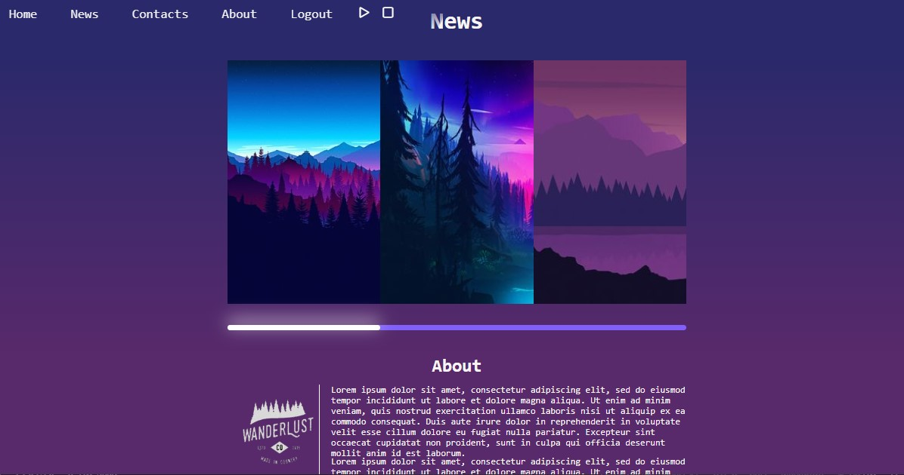

# Website frontend example
## A study of animation and parallax effects with HTML, CSS, JavaScript. On backend, a Nodejs server with MySQL connection.

# Examples

## Backend
### npm install 

### npm start

## Frontend
### Open local file in browser

## Author:
### Bruno Polli